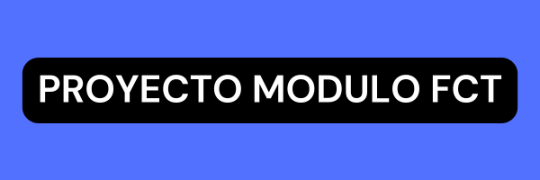

## Desarrollo de una aplicación de productividad con Pomodoro :iphone:

Este proyecto fue desarrollado para el curso de [_Desarrollo de aplicaciones multiplataforma_][enlace_curso] del turno vespertino.

<pre> 
</pre>

### Autor
Aura

### Tutor

Rufino

***

>Enfocabita es una aplicación de **productividad** que combina el seguimiento de **habitos** diarios con un temporizador pomodoro, para optimizar la gestión del tiempo :watch:.
***

Nuestros principales _**objetivos**_ al desarrollar esta aplicación son:

* Permitir crear y clasificar los habitos en tres _categorias_: Habitos que se desean mantener, adquirir y abandonar.
* Visualizar el _progreso_ a traves de un calendario.
* Que el usuario pueda pueda consultar su _racha_ de habitos cumplidos.
* _Recordatorios_ para realizar los habitos.
* Gestionar sesiones de trabajo enfocadas, con la ayuda de un temporizador _Pomodoro_.
  
***

    Antes de iniciar el desarrollo del proyecto, realizamos estudios para determinar el diseño y estructura que tendria la aplicación, no solo en su comportamiento, si no el funcionamiento general al estar en ejecución.

Las actividades que realizamos para completar el desarrollo fueron las siguientes:

1. Determinar los recursos y herramientas a utilizar:
    - Elegir recursos software y hardware para crear la aplicación como:

    	    

    - Analizar que lenguajes se ajustaban adecuadamente a los requisitos del proyecto. Al ser pensada como una aplicación android, se decidio implementar:

          

    - Diseño de la arquitectura y modelo de datos:
    

[enlace_curso]:(https://www.todofp.es/que-estudiar/familias-profesionales/informatica-comunicaciones/des-aplicaciones-multiplataforma.html)